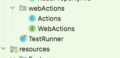

# BDD cucumber with selenium framework

## Table of Contents
 - #### [1.Introduction](#1-introduction)
 - #### [2.Installation](#3-installation)
 - #### [3.How to trigger the test](#3-how-to-trigger-the-test)
 
### Introduction
BDD cucumber is a framework and methodology for developing and testing software based on the principles of collaboration and communications among developers,
testers, and non= technical stakeholders. BDD aims to improve the clarity and understanding of software requirements

Key components include:
1. **Feature Files**: Written in Gherkin syntax, a plain text language that is easy to read and write.
2. **Scenarios**: Scenarios are individual test cases. It is written using syntax
   1. **Given**: Represents the initial context
   2. **When**: Describes the action
   3. **Then**: Described expected outcome
3. **Step Definitions**:Step definitions are written in programming language like Java, Python, Kotlin etc. Step definitions are responsible for interacting with the 
                    application and making assertions about its behaviour.
4. **Test Runners**: Test runners are responsible for executing the feature files and step definition.
5. **Reports**: Built in reports are generated by cucumber in different formats like JSON, HTML.

### Installation
1. Set up your development environment
   1. Install Java 11 SDK
   2. Install Maven 
   3. Set up the environmental variables
   4. Clone project from GitHub
   5. Set Editor like IntelliJ and open the cloned project
   6. Fix the possible SDK issues
   7. Configuration
      1. Enter the Credentials in config.properties file
   
### How to trigger the test
1. Add the scenario tag in Test Runner file
2. Right click in TestRunner class and select TestRunner

